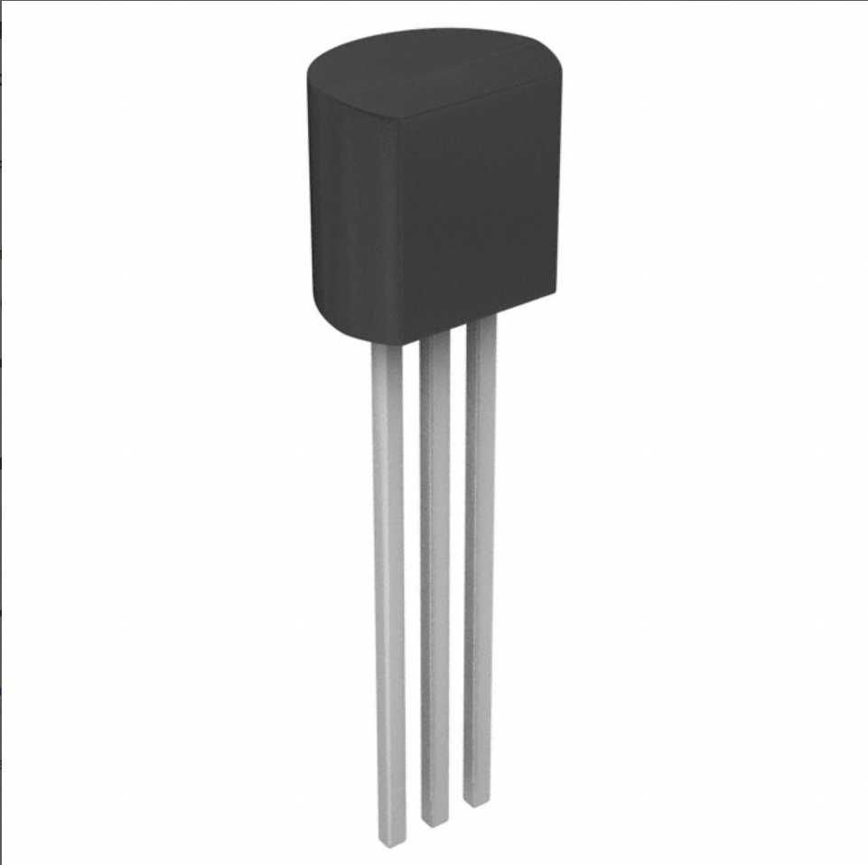

### Style 2

**Thermistor / Thermometer**

1. LM35DZ/NOPB Thermometer

    

    * $1.67/each
    * [LM35DZ/NOPB](https://www.digikey.com/en/products/detail/texas-instruments/LM35DZ-NOPB/32489?)

    | Pros                                      | Cons                                                             |
    | ----------------------------------------- | ---------------------------------------------------------------- |
    | Inexpensive                               | Doesnt meet project requirements of filtering signals            |
    | Compatible with PSoC                      | Small component and harder to mount to project                   |
    | Works with simple connection and no code  |

2. SNS-DHT11 Thermistor

    

    * $4.37/each
    * [SNS-DHT11](https://www.digikey.com/en/products/detail/olimex-ltd/SNS-DHT11/21662551)

    | Pros                                                              | Cons                  |
    | ----------------------------------------------------------------- | --------------------- |
    | Provides multiple readings (Temperature/Humidity)                 | More expensive        |
    | Through hole connection and comes with extending wires            | 5 week shipping speed |
    | PSoC compatible, but requires some code to filter signals         |

**Choice:** Option 2: SNS-DHT11 Thermistor

**Rationale:** While it is the more expensive option it comes with 2 thermistors saving our team from placing multiple orders. This product also meets all project requirements as software will be needed to filter input and output signals rather than just purchasing a "plug and play" sensor. This thermistor also has a larger body allowing for easier mounting to our product.
