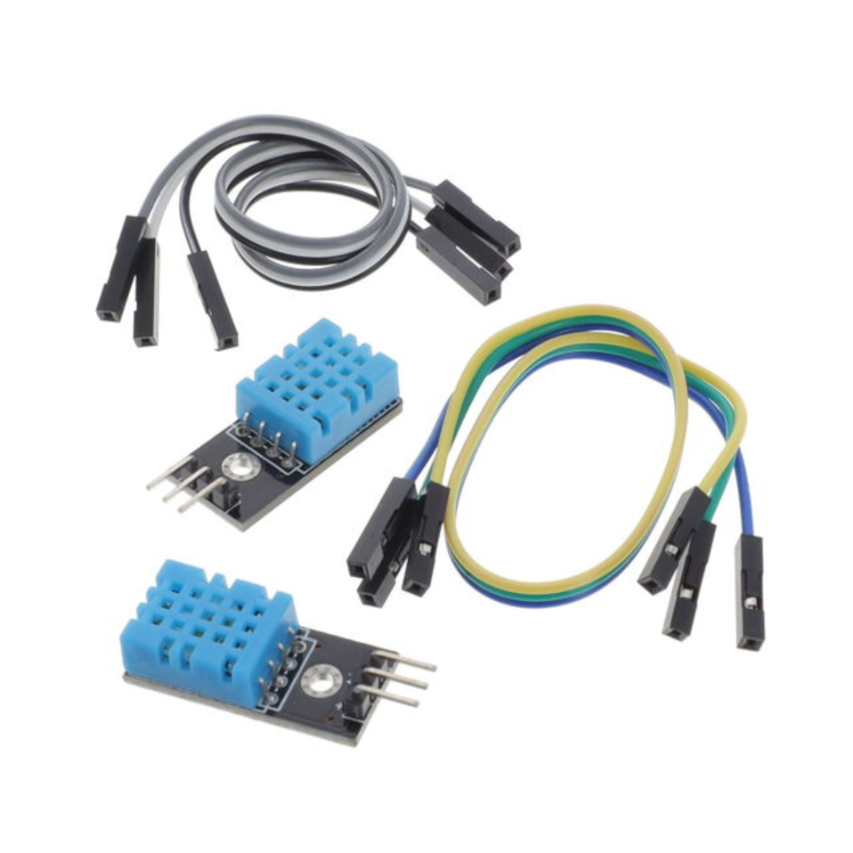
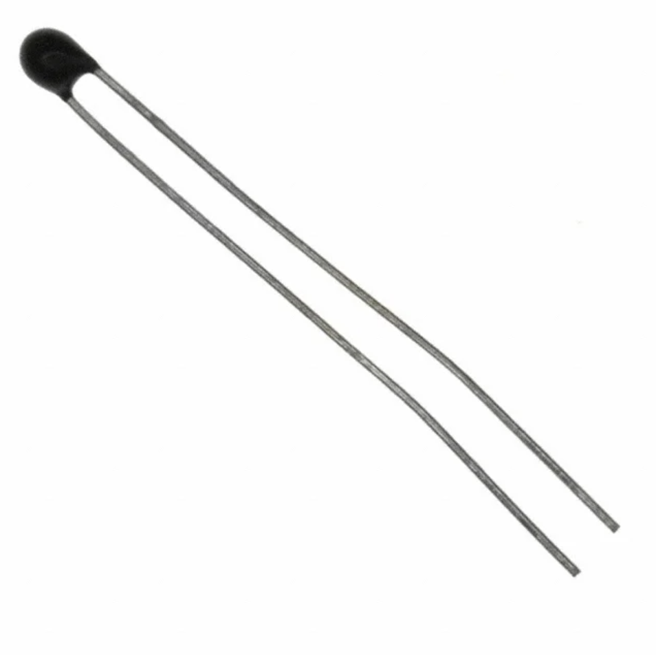

### Style 2

**Thermistor / Thermometer**

1. LM35DZ/NOPB Thermometer

    

    * $1.67/each
    * [LM35DZ/NOPB](https://www.digikey.com/en/products/detail/texas-instruments/LM35DZ-NOPB/32489?)

    | Pros                                      | Cons                                                             |
    | ----------------------------------------- | ---------------------------------------------------------------- |
    | Inexpensive                               | Doesnt meet project requirements of filtering signals            |
    | Compatible with PSoC                      | Small component and harder to mount to project                   |
    | Works with simple connection and no code  |

2. SNS-DHT11 Thermistor

    

    * $4.37/each
    * [SNS-DHT11](https://www.digikey.com/en/products/detail/olimex-ltd/SNS-DHT11/21662551)

    | Pros                                                              | Cons                  |
    | ----------------------------------------------------------------- | --------------------- |
    | Provides multiple readings (Temperature/Humidity)                 | More expensive        |
    | Through hole connection and comes with extending wires            | 5 week shipping speed |
    | PSoC compatible, but requires some code to filter signals         |

3. MF52A2103J3470 Thermistor

   

   * $0.37/each
   * [MF52A2103J3470](https://www.digikey.com/en/products/detail/cantherm/MF52A2103J3470/1191033)
  
   | Pros                             | Cons                               |
   | -------------------------------- | ---------------------------------- |
   | Cheapest Option                  | Worst Tolerances                   |
   | Simplest construction            | Fragile tails                      |
   | Easiest to replace               | Most difficult to filter with code |
   
**Choice:** Option 3: MF52A2103J3470 Thermistor

**Rationale:** While it is the cheapest option and simplest in form this thermistor best fits the project requirements. It will require the most work to code a filter to process data which is required, and if broken it is the easiest part to replace quickly. This Thermistor also has the worst tolerances which allows for extra experience fine tuning until we reach our desired results.
