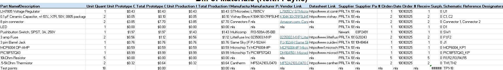

## Overview
The Bill of Materials included below displays all major components required in the construction of the PCB. The LED, 10 kOhm resistors, and test points are present in the BOM, but were supplied in bulk at no cost so they're only included to display number required not actual cost to construct.

## Bill of Materials Example (as Image)
{style width: "2000"}
**Figure 2:** Example Bill of Materials as a screenshot.

As you can see, the text can be difficult to read without opening the image.
