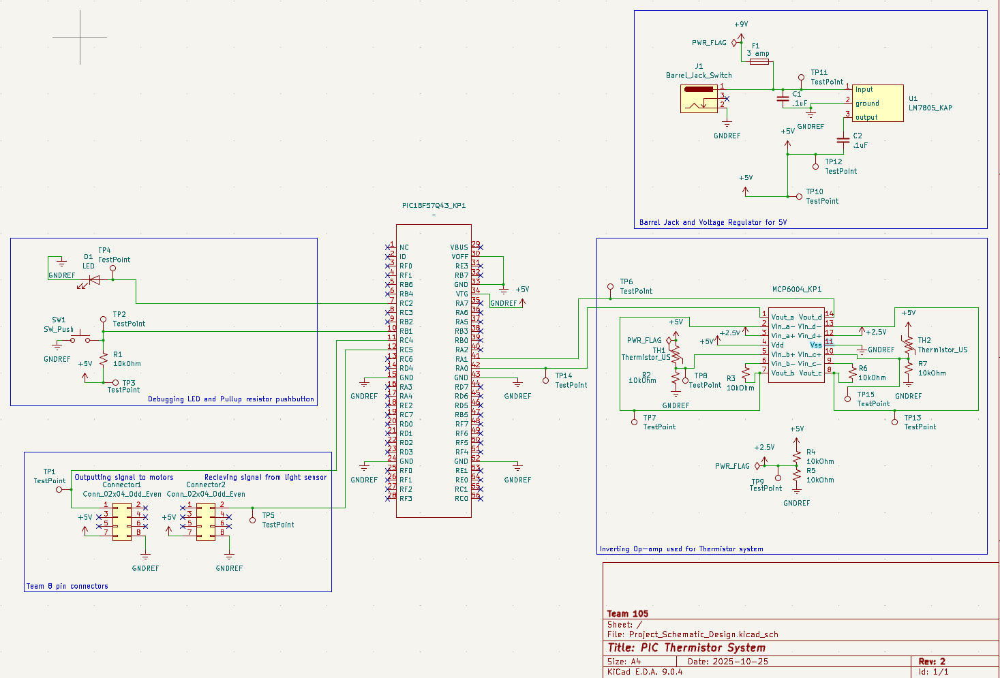

## Overview

This schematic is designed to recieve a high or low signal to begin collecting data from 2 thermistors, collect the values output by the thermistors, and then send that data to another teamates PIC board as a high or low signal. Those signals will then begin to trigger motor actuation allowing for temperature control and maintinence using the blinds.

{style width:"350" height:"300;"}
**Figure 01:** Showing current schematic (Revision 2).

## Resouces

The schematic as a PDF download is available [*here*](Project_Schematic_Design.pdf), and the Zip folder of the project [*here*](Project_Schematic_Design3.zip).
