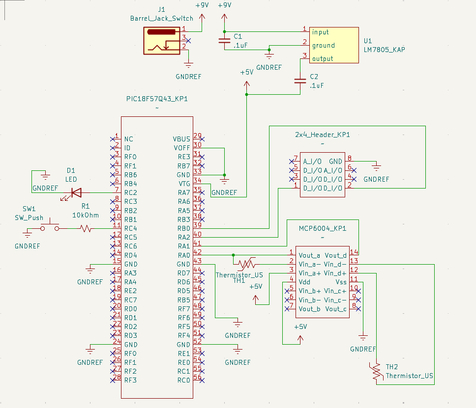

## Overview

This schematic is design to support 2 thermistors, collect the values output by the thermistors, and send that data to another teamates PIC board.

{style width:"350" height:"300;"}
**Figure ##:** Showing a example schematic.

## Resouces

The schematic as a PDF download is available [*here*](Project_Schematic_Design.pdf), and the Zip folder of the project [*here*](Project_Schematic_Design.zip).
